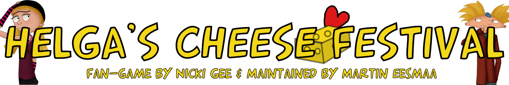

# Helga's Cheese Festival

Helga's Cheese Festival - A Ren'Py visual novel story fan-made game with Helga and Arnold's true love story based on Hey Arnold.

Please note that fan-game project was done by Nicki Gee (Wolfs-Angel17).

Maintained by Martin Eesmaa

Development begun: Sun Feb 26 20:48:50 2012 UTC (Unix timestamp: 1330289330)

Development finished was on 24th June 2013 and took 1 year and almost 4 months with breaks/hiatus to develop the game

# Notes of this game

See the [LICENSE](LICENSE) file.

See the [Credits](CREDITS.txt) file.

Reconstruction of beta textbox made by Martin Eesmaa using GIMP in pre-release versions before it was finalized textbox, [link to download](https://github.com/MartinEesmaa/HAHCF/raw/892c342ec0af719817dcfba2b599c1127984249e/game/textbox-beta.xcf). Licensed on CC-BY 4.0.

The logo at the top of this document was created by Martin Eesmaa using Inkscape and is licensed on CC-BY-SA 4.0. The character sprites were made and used by Nicki Gee.

## Download the game

To download and play the game, please visit the link via DeviantArt [here](https://www.deviantart.com/wolfs-angel17/art/380463895).

She provided three versions of Windows, Mac, and Linux, which were announced and uploaded to her 4shared account. But source code was released later without public notice and uploaded to her account. The account requires a login, if needed, and has a 20-second time limit to download compressed files.

Alternatively, you can get from this page:

https://github.com/MartinEesmaa/HAHCF/releases

## Compile the game

To compile the game, you can have two choice to download via green button or just git clone it.

You need:

- Windows, macOS or Linux to use Ren'Py builder.
- Ren'Py 6.13 or some versions later work (tested [6.13](https://www.renpy.org/release/6.13) & [6.15](https://www.renpy.org/release/6.15)). Original build was used on Ren'Py 6.15.4.320.

Step 1: Follow the instructions on Ren'Py.

Step 2: Once you installed Ren'Py on your computer. Download the source code.

If you haven't heard Git before, Git is cloning tool used commonly by programmers, but you can download the project by pressing Code button and then click Download ZIP.

Step 3: Uncompress ZIP file to drag into renpy folder.

Step 4: Launch Ren'Py on your computer and make sure select downloaded project game folder and then you can launch the project or build distributions.

If you're not sure or understand, you can create an issue on GitHub. I feel free to help you. :)

# Disclaimer

This project of the game is a fan-made, non-commercial tribute to "Hey Arnold!" 
and is not affiliated with or endorsed by Craig Bartlett, Nickelodeon, Viacom, Paramount or any other rights holders. 

All original characters, music, art, videos and trademarks belong to their respective owners. 
This source code is released under the MIT License, but use of copyrighted material is subject to the rights holders' terms.

# Support

If you loved this fan-made game, you can support her hard work by going to her YouTube channel, Patreon and other her social medias.

[Nicki Gee's YouTube channel](https://www.youtube.com/@Nicki_Gee)

[Nicki Gee's Patreon](https://www.patreon.com/user?u=2278208)

And also please support to Craig Bartlett for creating Hey Arnold TV series to your childhood and your favorite things related to.

Even for me as Martin Eesmaa I worked hard to make history commits to my repo, so you can check out my social medias [there](https://linktr.ee/martineesmaa).

- Martin Eesmaa
